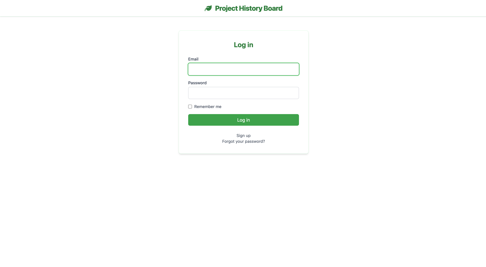
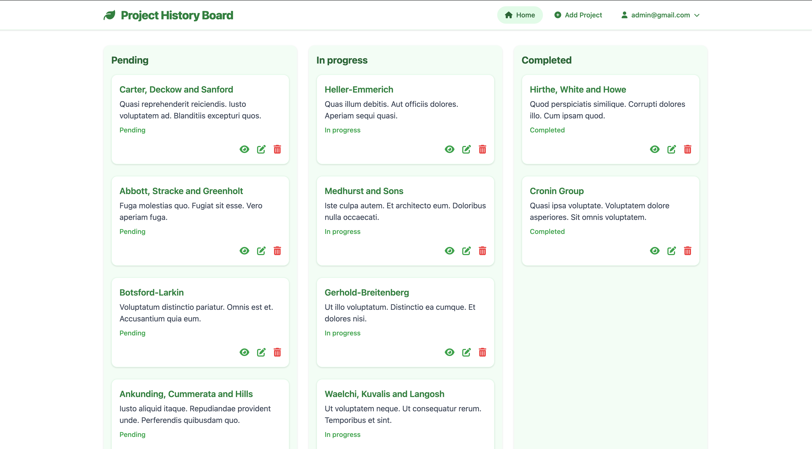
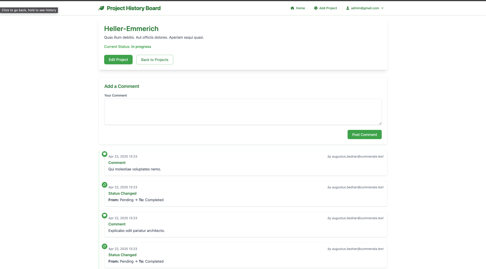
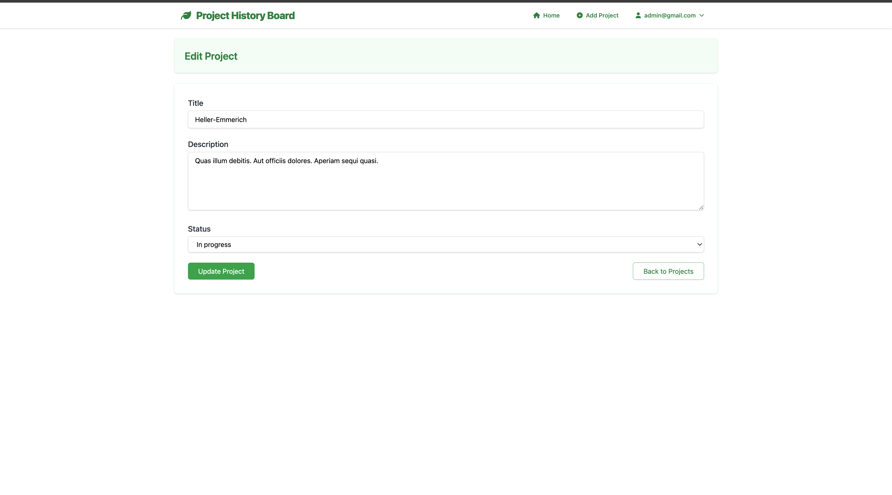

# Project History Board

**Project History Board** is a Ruby on Rails web application designed to streamline project discussions. Users can sign up, create and view projects, leave comments, and update project statuses. This tool is ideal for teams looking to maintain clear communication throughout a project's lifecycle.


## 🖼️ Screenshots

```markdown




```

---

## 🖥️ Tech Stack

- **Backend:** Ruby 3.4.1, Rails 8.0.2
- **Database:** PostgreSQL
- **Frontend:** ERB
- **Hosting:** [Render](https://render.com)

---

## 🛠️ Run Locally

### 1. **Clone the Repository**
```sh
git clone https://github.com/jawadkazmi-dev/ProjectHistoryBoard.git
cd ProjectHistoryBoard
```

### 2. **Install Dependencies**
```sh
bundle install
```

### 3. **Database Setup**
```sh
rails db:create
rails db:migrate
rails db:seed
```

### 4. **Start the Server**
```sh
./bin/dev
```

---

## ✅ Running Tests
To run tests, execute:
```sh
bundle exec rspec
```

---

## 🔐 Super Admin Access
Want to skip sign-up?

- **Email:** `admin@gmail.com`  
- **Password:** `12345678`

---